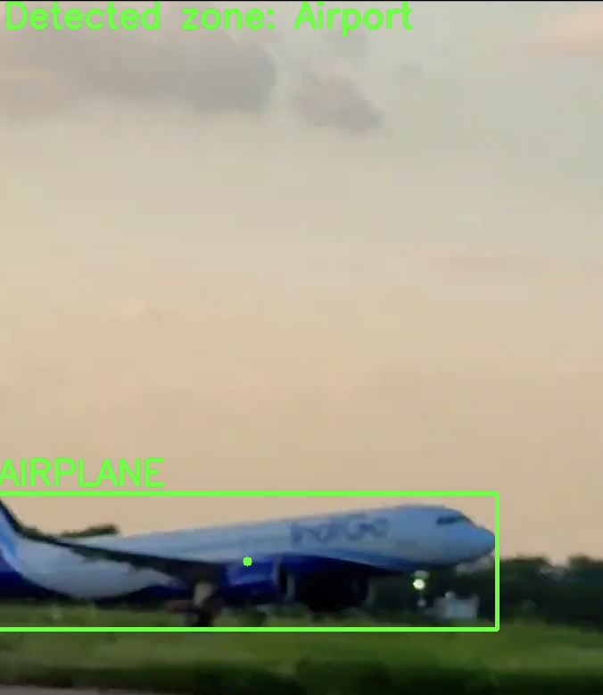

# Zone Detection
## Introduction
Zone Detection is a project aimed at predicting the location of events in videos based on objects detected by the YOLOv8 (You Only Look Once) neural network. The custom Tensorflow-model identifies specific zones such as roads, airports, and pedestrian zones where events might occur.
## Example

Model detect some specific objects and based on them, make a prediction about place on the videofile. Human mind works actually the pretty same way - to understand where a person is, he analyzes the surrounding environment, especially some specific objects. For example, if a person is blindfolded and taken to an unfamiliar place, he will be confused and will not understand where he is. But if he sees, for example, an airplane there, he will conclude that he is at the airport. Similarly, this neural network draws conclusions about its location based on surrounding objects.

## Features
- Utilizes YOLO for object detection.
- Predicts event locations based on detected objects.
- Supports multiple event zones: roads, airports, and pedestrian zones.
- Provides flexibility for customizing and extending the model.
